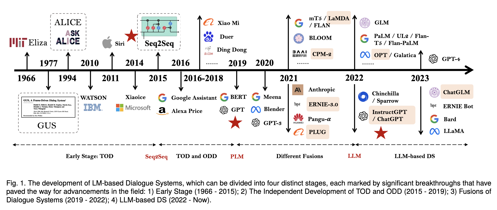
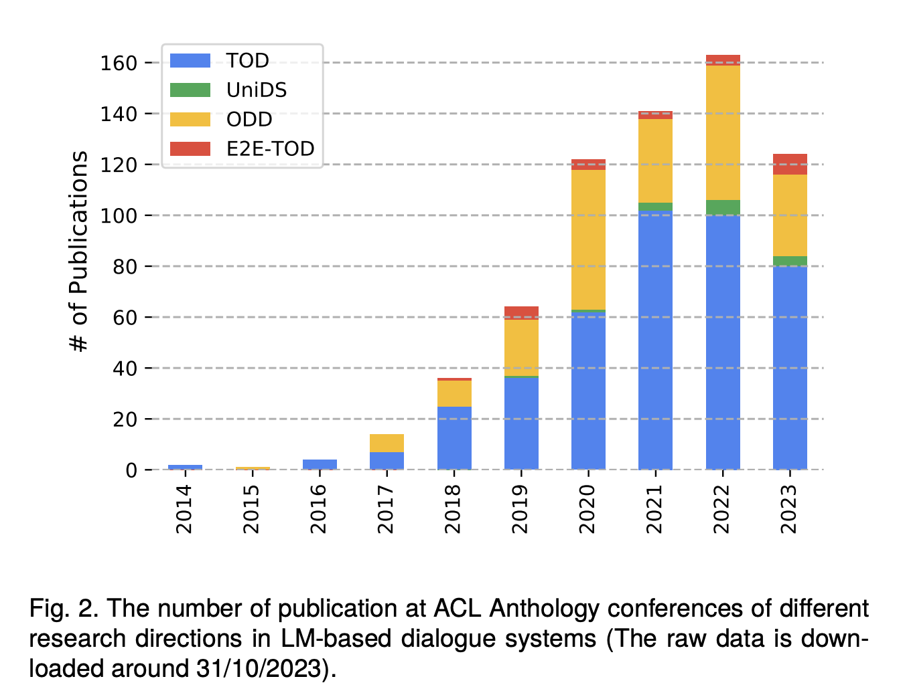
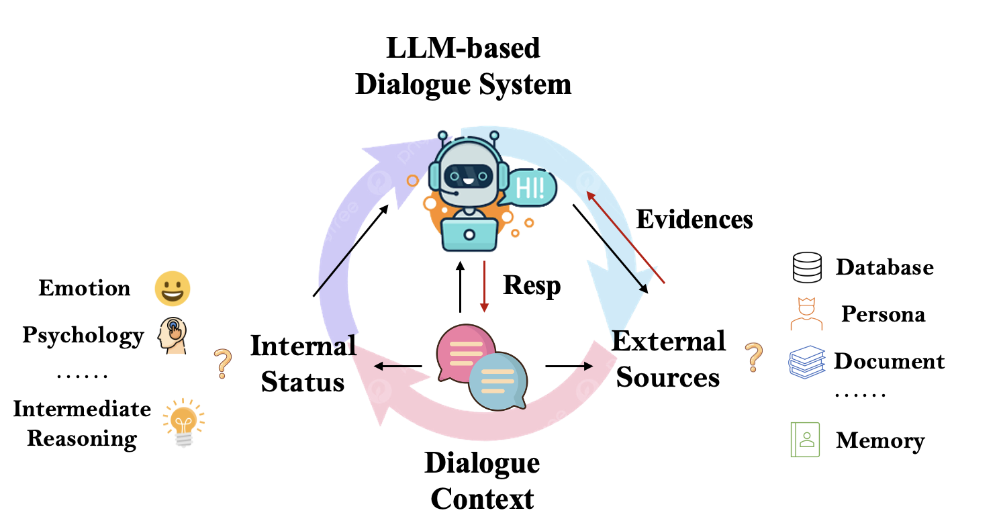

# Survey-Evolution-DS

This is the repo which records the evolution of LM-based dialogue system. We list works in each stage, and will constantly update it, welcome to raise a issue to add new works!!


- Task-oriented Dialogue System (TOD)
  - Natural Language Understanding (NLU)
  - Dialogue State Tracking (DST)
  - Dialogue Policy Learning (DST)
  - Natural Language Generation (NLG)
  - End-to-End TOD (E2E TOD)
- Open-domain Dialogue System (ODD)
- Unified Dialogue System (UniDS)

## News

- 8 Nov, 2024: We are happy to see renaissance of task-oriented dialogue system, which inspires lots of recent work, such as $\tau$-Bench, AppBench and so on.

## The Evolution of LM-based Dialogue System





## Survey Paper

- [A Survey of Language Model-based Dialogue System](https://arxiv.org/abs/2311.16789) :fire::fire::fire::fire::fire: we write a blog for better understanding: `TOD` `ODD` `PLM` `LLM` click [here](https://candle-walker-56d.notion.site/810f553406cb42558c41d00a560467cf?pvs=4).

- [End-to-end Task-oriented Dialogue: A Survey of Tasks, Methods, and Future Directions](https://github.com/ruleGreen/Survey-Evolution-DS.git) `E2E TOD` `EMNLP 2023` :fire::fire::fire:

- [Recent advances in deep learning based dialogue systems: a systematic survey](https://sentic.net/dialogue-systems-survey.pdf) `Artificial Intelligence Review 2023` :fire::fire::fire:

- [A Survey on Recent Advances and Challenges in Reinforcement Learning Methods for Task-oriented Dialogue Policy Learning](https://link.springer.com/article/10.1007/s11633-022-1347-y)`DPL` `Machine Intelligence Research 2023` :fire:

- [A Survey on Proactive Dialogue Systems: Problems, Methods, and Prospects](https://arxiv.org/abs/2305.02750) `ODD` `IJCAI 2023` :fire::fire:

- [Let's Negotiate! A Survey of Negotiation Dialogue Systems](https://arxiv.org/pdf/2212.09072.pdf) `ODD` `Arxiv 2022`

- [Recent advances and challenges in task-oriented dialog systems](https://link.springer.com/article/10.1007/s11431-020-1692-3)`TOD` `SCTC 2020`

- [Challenges in Building Intelligent Open-domain Dialog Systems](https://dl.acm.org/doi/abs/10.1145/3383123) `ODD` `TOIS 2020`

- [A Survey on Dialogue Systems: Recent Advances and New Frontiers](https://dl.acm.org/doi/10.1145/3166054.3166058) `TOD` `ODD` `SIGKDD 2017`

## 1st Stage -- SLM: Early Stage

- Eliza, Alice, GUS

## 2nd Stage -- NLM: Independent Development

- [End-to-End Learning of Task-Oriented Dialogs](https://aclanthology.org/N18-4010/)`E2E TOD` `NAACL 2018` first E2E TOD

- [Assigning Personality/Profile to a Chatting Machine for Coherent Conversation Generation](https://arxiv.org/abs/1706.02861) `ODD` `IJCAI 2018`

## 3rd Stage -- PLM: Fusion Starts!

- [Improving Factual Consistency for Knowledge-Grounded Dialogue Systems via Knowledge Enhancement and Alignment](https://arxiv.org/abs/2310.08372.pdf) `ODD` `EMNLP 2023` :fire::fire:

- [Re3Dial: Retrieve, Reorganize and Rescale Conversations for Long-Turn Open-Domain Dialogue Pre-training](https://arxiv.org/abs/2305.02606) `ODD` `EMNLP 2023` :fire::fire::fire:

- [DiSTRICT: Dialogue State Tracking with Retriever Driven In-Context Tuning](https://arxiv.org/pdf/2212.02851.pdf) `DST` `EMNLP 2023` T5 model

- [Well Begun is Half Done: Generator-agnostic Knowledge Pre-Selection for Knowledge-Grounded Dialogue](https://arxiv.org/abs/2310.07659) `ODD` `EMNLP 2023` BART, T5

- [Turn-Level Active Learning for Dialogue State Tracking](https://arxiv.org/pdf/2310.14513.pdf) `RL` `EMNLP 2023`

- [JoTR: A Joint Transformer and Reinforcement Learning Framework for Dialog Policy Learning](https://arxiv.org/abs/2309.00230.pdf) `DPL` `TOD` `Arxiv 2023`

- [Retrieval-free Knowledge Injection through Multi-Document Traversal for Dialogue Models](https://aclanthology.org/2023.acl-long.364/) `ODD` `ACL 2023`

- [Learning to Generate Prompts for Dialogue Generation through Reinforcement Learning](https://arxiv.org/abs/2206.03931) `ODD` `Arixv 2022`

- [Integrating Pretrained Language Model for Dialogue Policy Evaluation](https://ieeexplore.ieee.org/abstract/document/9747593.pdf) `DPL` `TOD` `ICASSP 2022` :fire::fire::fire: first work of RLAIF in DPL

- [Personalized Dialogue Generation with Persona-Adaptive Attention](https://arxiv.org/abs/2210.15088) `ODD` `AAAI 2023`

### 3.1: Fusions within TOD

- [Modularized Pre-Training for End-to-End Task-Oriented Dialogue](https://ieeexplore.ieee.org/abstract/document/10043710) `E2E TOD` `TASLP 2023`

- **PPTOD**: [Multi-Task Pre-Training for Plug-and-Play Task-Oriented Dialogue System](https://aclanthology.org/2022.acl-long.319/) `E2E TOD` `ACL 2022`

- [Soloist: Building Task Bots at Scale with Transfer Learning and Machine Teaching](https://aclanthology.org/2021.tacl-1.49/) `E2E TOD` `TACL 2021`

- [MOSS: End-to-End Dialog System Framework with Modular Supervision](https://arxiv.org/abs/1909.05528.pdf) `AAAI 2020` first work for modular E2E TOD

### 3.2: Fusion between TOD with ODD

- [Dual-Feedback Knowledge Retrieval for Task-Oriented Dialogue Systems](https://arxiv.org/pdf/2310.14528.pdf) `EMNLP 2023` T5 model, related to Q-TOD

- [Continual Dialogue State Tracking via Example-Guided Question Answering](https://arxiv.org/pdf/2305.13721.pdf) `EMNLP 2023` T5 model

- [Enabling Semi-Structured Knowledge Access via a Question-Answering Module in Task-oriented Dialogue Systems](https://dl.acm.org/doi/10.1145/3571884.3597138) `QA -> TOD` `CUI 2023`

- [Q-TOD: A Query-driven Task-oriented Dialogue System](https://aclanthology.org/2022.emnlp-main.489.pdf) `TOD -> ODD` `EMNLP 2022`

- [UniDS: A Unified Dialogue System for Chit-Chat and Task-oriented Dialogues](https://aclanthology.org/2022.dialdoc-1.2/) `ODD -> TOD` `DialDoc 2022`

- [GODEL: Large-Scale Pre-Training for Goal-Directed Dialog](https://arxiv.org/abs/2206.11309) `TOD -> ODD` `Arxiv 2022` [[Code]](https://github.com/microsoft/GODEL)

### 3.3: Fusion between DM and LLM

- **LLaMA2-Chat** [Llama 2: Open Foundation and Fine-Tuned Chat Models](https://arxiv.org/abs/2307.09288) `Arxiv 2023`

- **Parrot**: [Enhancing Multi-Turn Chat Models by Learning to Ask Questions](https://arxiv.org/pdf/2310.07301.pdf) `Arxiv 2023` multi-turn instruction-tuning data construction

- [Enhancing Chat Language Models by Scaling High-quality Instructional Conversations](https://arxiv.org/abs/2305.14233) `EMNLP 2023`

- [**BlenderBot 3**: a deployed conversational agent that continually learns to responsibly engage](https://arxiv.org/abs/2208.03188) `Arxiv 2022`

- [**Pangu-Bot**: Efficient Generative Dialogue Pre-training from Pre-trained Langauge Model](https://arxiv.org/abs/2203.17090) `Arxiv 2022`

### Others

- [Improving the Robustness of Knowledge-Grounded Dialogue via Contrastive Learning](https://arxiv.org/pdf/2401.04361.pdf) target noises in the input such as kg or misspelling in the query `ODD`

## 4nd Stage -- LLM-based Dialogue System

### 4.1: Internal Reasoning

- [Investigating Content Planning for Navigating Trade-offs in Knowledge-Grounded Dialogue](https://arxiv.org/pdf/2402.02077.pdf) content planning similar with TPE

- [COOPER: Coordinating Specialized Agents towards a Complex Dialogue Goal] `AAAI 2024` multi-agent cue-cot？

-[Reverse Multi-Choice Dialogue Commonsense Inference with Graph-of-Thought](https://arxiv.org/abs/2312.15291) `AAAI 2024`

- [Cue-CoT: Chain-of-thought Prompting for Responding to In-depth Dialogue Questions with LLMs](https://arxiv.org/pdf/2305.11792.pdf) `ODD` `EMNLP 2023` :fire::fire::fire: linguistic cues

- [Symbolic Planning and Code Generation for Grounded Dialogue](https://arxiv.org/pdf/2310.17140v1.pdf) `TOD` `EMNLP 2023` [[code]](https://github.com/justinchiu/onecommon-gpt) interesting

- Scalable-DSC: A Structural Template Prompt Approach to Scalable Dialogue State Correction `EMNLP 2023`

- [Mirages: On Anthropomorphism in Dialogue Systems](https://arxiv.org/pdf/2305.09800v1.pdf) `ODD` `EMNLP 2023` linguistic cues

- [Prompt-Based Monte-Carlo Tree Search for Goal-Oriented Dialogue Policy Planning](https://arxiv.org/abs/2305.13660.pdf) `TOD` `DPL` `EMNLP 2023`

### Proactive

- [Prompting and Evaluating Large Language Models for Proactive Dialogues: Clarification, Target-guided, and Non-collaboration](https://arxiv.org/abs/2305.13626.pdf) `ODD` `EMNLP 2023`

- [Target-oriented Proactive Dialogue Systems with Personalization: Problem Formulation and Dataset Curation](https://arxiv.org/pdf/2310.07397.pdf) `ODD` `EMNLP 2023`

- [Rethinking Conversational Agents in the Era of LLMs: Proactivity, Non-collaborativity, and Beyond](https://dl.acm.org/doi/abs/10.1145/3624918.3629548) `ODD` `SIGIR-AP 2023`

### Empathetic Dialogue

- [EmoBench: Evaluating the Emotional Intelligence of Large Language Models](https://arxiv.org/pdf/2402.12071.pdf)

- [E-CORE: Emotion Correlation Enhanced Empathetic Dialogue Generation](https://arxiv.org/abs/2311.15016.pdf) `EMNLP 2023`

- [Commonsense-Aware Prompting for Controllable Empathetic Dialogue Generation](https://arxiv.org/abs/2302.01441) `ODD` `EMNLP 2023`

- [Harnessing the Power of Large Language Models for Empathetic Response Generation: Empirical Investigations and Improvements]

### 4.2: External Acting / Interactions

- [$\tau$-bench: A Benchmark for Tool-Agent-User Interaction in Real-World Domains](https://arxiv.org/abs/2406.12045.pdf) `language agent` `task-oriented ds` :fire::fire::fire:

- [Hello Again! LLM-powered Personalized Agent for Long-term Dialogue](https://arxiv.org/abs/2406.05925.pdf) using memory/persona as external sources

- **SAFARI:** [Large Language Models as Source Planner for Personalized Knowledge-grounded Dialogues](https://arxiv.org/pdf/2310.08840.pdf) `ODD` `EMNLP 2023` :fire::fire::fire::fire::fire: related work: Self-RAG, ToolkenGPT, RAG. dependency between different sources

- [ChatCoT: Tool-augmented Chain-of-Thought Reasoning on Chat-based Large Language Models](https://arxiv.org/abs/2305.14323) `EMNLP 2023`

- [Towards LLM-driven Dialogue State Tracking](https://arxiv.org/pdf/2310.14970.pdf) `DST` `EMNLP 2023` instruction-tuning

- Multi-Source Multi-Type Knowledge Exploration and Exploitation for Dialogue Generation `EMNLP 2023`

- [PLUG-AND-PLAY POLICY PLANNER FOR LARGE LANGUAGE MODEL POWERED DIALOGUE AGENTS](https://arxiv.org/pdf/2311.00262.pdf) `Arxiv 2023`

- [Reinforcement Learning for Optimizing RAG for Domain Chatbots] `AAAI 2024 Workshop` using rl to determine whether or not to retrieve for domain chatbots

- [Manual-Guided Dialogue for Flexible Conversational Agents](https://arxiv.org/abs/2208.07597.pdf)

### Database

- [Are LLMs All You Need for Task-Oriented Dialogue?](https://aclanthology.org/2023.sigdial-1.21/) `TOD` `SIGDIAL 2023` all sub tasks

### Memory

- [MemoChat: Tuning LLMs to Use Memos for Consistent Long-Range Open-Domain Conversation](https://arxiv.org/pdf/2308.08239.pdf) `ODD` `Arxiv 2023`[[Code](https://github.com/LuJunru/MemoChat)]

- [Prompted LLMs as Chatbot Modules for Long Open-domain Conversation](https://aclanthology.org/2023.findings-acl.277/) `ODD` `ACL 2023`

### Persona/Character/Profile/Role

- [PK-ICR: Persona-Knowledge Interactive Multi-Context Retrieval for Grounded Dialogue](https://arxiv.org/pdf/2302.06674.pdf) `EMNLP 2023` dependency between different sources

- [Large Language Models Meet Harry Potter: A Dataset for Aligning Dialogue Agents with Characters](https://arxiv.org/abs/2211.06869.pdf) `Dataset` `EMNLP 2023`

- Building Persona Consistent Dialogue Agents with Offline Reinforcement Learning `EMNLP 2023`

- [CharacterChat: Supporting the Creation of Fictional Characters through Conversation and Progressive Manifestation with a Chatbot](https://arxiv.org/abs/2106.12314.pdf)

- [What, When, and How to ground: Designing User Persona-Aware Conversational Agents for Engaging Dialogue](https://aclanthology.org/2023.acl-industry.68/) `ACL 2023 Industry`

- [Building Persona Consistent Dialogue Agents with Offline Reinforcement Learning](https://aclanthology.org/2023.emnlp-main.110.pdf) :fire: `EMNLP 2023` offline reinforcement learning

- [Partner Personas Generation for Dialogue Response Generatio](https://aclanthology.org/2022.naacl-main.382/) `NAACL 2022` reinforcement learning

### Multilingual

- [A Systematic Study of Performance Disparities in Multilingual Task-Oriented Dialogue Systems](https://arxiv.org/pdf/2310.12892v1.pdf) `EMNLP 2023`

- [xDial-Eval: A Multilingual Open-Domain Dialogue Evaluation Benchmark](https://arxiv.org/pdf/2310.08958v1.pdf) `EMNLP 2023`

### 4.3: Reasoning + Acting

- [TPE: Towards Better Compositional Reasoning over Conceptual Tools with Multi-persona Collaboration](https://arxiv.org/abs/2309.16090.pdf) `ODD` `Arxiv 2023` :fire::fire::fire::fire::fire: language agent, tool learning

- Learning Retrieval Augmentation for Personalized Dialogue Generation `EMNLP 2023`

- TOD-Flow: Modeling the Structure of Task-Oriented Dialogues `EMNLP 2023`

- Enhancing Task-oriented Dialogue Systems with Generative Post-processing Networks `EMNLP 2023`

- [Retrieval-Generation Alignment for End-to-End Task-Oriented Dialogue System](https://arxiv.org/pdf/2310.08877v2.pdf) `EMNLP 2023` T5 and ChatGPT as generator, related to Q-TOD, Dual-Feedback?

- [ChatPLUG: Open-Domain Generative Dialogue System with Internet-Augmented Instruction Tuning for Digital Human](https://arxiv.org/abs/2304.07849)

### Others

- [Bootstrapping LLM-based Task-Oriented Dialogue Agents via Self-Talk](https://arxiv.org/pdf/2401.05033.pdf) `TOD` data augmentation

- [Multi-User Chat Assistant (MUCA): a Framework Using LLMs to Facilitate Group Conversations](https://arxiv.org/pdf/2401.04883.pdf)

## What's the future? Language Agents?



### Multi-modal

- [SIMMC 2.0: Situated Interactive Multimodal Conversational AI](https://arxiv.org/abs/2104.08667.pdf)

## Dataset Paper

- [INSCIT: Information-Seeking Conversations with Mixed-Initiative Interactions](https://arxiv.org/abs/2207.00746.pdf) `TACL 2022`

- **DuLeMon**: [Long Time No See! Open-Domain Conversation with Long-Term Persona Memory](https://aclanthology.org/2022.findings-acl.207/) `ODD` `ACL 2022`

- **FoCus**: [Call for Customized Conversation: Customized Conversation Grounding Persona and Knowledge](https://arxiv.org/abs/2112.08619.pdf) `ODD` `AAAI 2022`

- [KdConv: A Chinese Multi-domain Dialogue Dataset Towards Multi-turn Knowledge-driven Conversation](https://aclanthology.org/2020.acl-main.635/) `ODD` `ACL 2020` [[code]](https://github.com/thu-coai/KdConv)

## Others

- [AUTOREPLY: Detecting Nonsense in Dialogue Introspectively with Discriminative Replies](https://aclanthology.org/2023.findings-emnlp.23.pdf) `EMNLP2023`

- [Instruct Once, Chat Consistently in Multiple Rounds: An Efficient Tuning Framework for Dialogue] `Tuning Method`

# Position and Future Directions

- [Personalisation within bounds: A risk taxonomy and policy framework for the alignment of large language models with personalised feedback](https://arxiv.org/abs/2303.05453.pdf)

- [SELF-DIRECTED SYNTHETIC DIALOGUES AND REVISIONS TECHNICAL REPORT](https://arxiv.org/abs/2407.18421.pdf)

- [Can a Single Model Master Both Multi-turn Conversations and Tool Use? CoALM: A Unified Conversational Agentic Language Model](https://arxiv.org/pdf/2502.08820.pdf) :fire::fire:

- [TOOLFLOW: Boosting LLM Tool-Calling Through Natural and Coherent Dialogue Synthesis](https://arxiv.org/pdf/2410.18447.pdf)

## Other Useful Resourecs

1. https://www.promptingguide.ai/papers [prompting engineering papers]
2. https://github.com/iwangjian/Paper-Reading#knowledge-grounded-dialogue

## To read

- Beyond Candidates : Adaptive Dialogue Agent Utilizing Persona and Knowledge

- Are Personalized Stochastic Parrots More Dangerous? Evaluating Persona Biases in Dialogue Systems

Welcome to cite our survey paper.

```
@misc{wang2023survey,
      title={A Survey of the Evolution of Language Model-Based Dialogue Systems},
      author={Hongru Wang and Lingzhi Wang and Yiming Du and Liang Chen and Jingyan Zhou and Yufei Wang and Kam-Fai Wong},
      year={2023},
      eprint={2311.16789},
      archivePrefix={arXiv},
      primaryClass={cs.CL}
}
```
